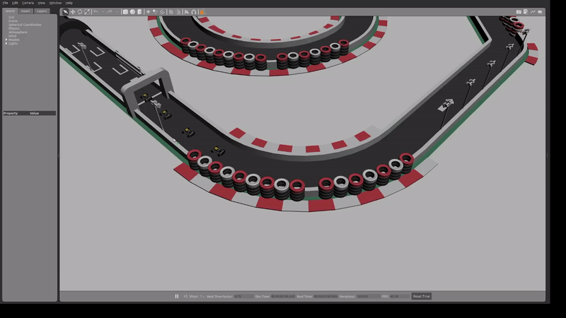

# AuNa: Autonomous Navigation System Simulator

[](packages/)
[](https://docs.ros.org/en/humble/)
[](https://docs.docker.com/compose/)

A comprehensive ROS2-based framework for autonomous vehicle simulation, featuring cooperative driving scenarios, multi-robot coordination, and advanced navigation algorithms. The system uses Docker Compose for easy deployment and provides Gazebo simulation with RViz visualization.



## 🚀 Key Features

- **Multi-Robot Simulation**: Support for multiple autonomous vehicles in coordinated scenarios
- **CACC Implementation**: Cooperative Adaptive Cruise Control for platooning scenarios
- **Advanced Navigation**: Integration with ROS2 Navigation2 stack for path planning and obstacle avoidance
- **Wall Following**: Robust wall-following algorithms using LIDAR data
- **Docker-based Deployment**: Simple containerized deployment - no manual installation required
- **Real-time Visualization**: Gazebo 3D simulation with RViz integration

## 🛠️ Installation

**Prerequisites**: Docker with docker compose support

1. **Clone the repository**:
   ```bash
   git clone https://github.com/HarunTeper/AuNa.git
   cd AuNa
   ```

## 🚀 Usage

### Running Simulations

The only supported method is through Docker Compose. You only need to specify the world name:

#### Single Robot Scenario
```bash
# Default world (racetrack_decorated)
docker compose --profile sim_scenario_1 up

# Specify custom world
WORLD_NAME=arena docker compose --profile sim_scenario_1 up
```

#### Multi-Robot Scenario (3 robots)
```bash
# Default world (racetrack_decorated) 
docker compose --profile sim_scenario up

# Specify custom world
WORLD_NAME=arena docker compose --profile sim_scenario up
```

### Available Worlds
- `racetrack_decorated` - Racing track environment (default)
- `arena` - Open arena environment

After launching, **Gazebo** and **RViz** windows will start automatically.

## 🎮 RViz Configuration

Once the simulation starts, you'll see both **Gazebo** (simulation) and **RViz** (visualization) windows.

### Setting Up Robot Namespace in RViz

1. **Enter the namespace** in RViz for each robot you want to control:
   - Format: `robot` + index (starting from 1)
   - Examples: `robot1`, `robot2`, `robot3`

2. **Select input source** after entering the namespace:
   - **Default**: `off` (no autonomous control)
   - **Available sources**:
     - `wallfollowing` - Follow walls using LIDAR
     - `teleop` - Manual keyboard control  
     - `nav2` - Navigation2 path planning
     - `cacc` - Cooperative Adaptive Cruise Control

### Robot Role Configuration

#### Leader Robot (robot1)
**For racetrack_decorated world:**
- Use `wallfollowing` for autonomous wall following
- Use `nav2` for goal-based navigation

**For arena world:**
- Use `nav2` for goal-based navigation  
- Use `cacc` for coordinated movement

#### Follower Robots (robot2, robot3, ...)
**For all worlds:**
- Use `cacc` for following the leader robot in formation

### Example Usage Flow

1. Start simulation:
   ```bash
   docker compose --profile sim_scenario up
   ```

2. In RViz window:
   - Enter namespace: `robot1`
   - Select input source: `wallfollowing` (for leader on racetrack)
   
3. For additional robots:
   - Enter namespace: `robot2` 
   - Select input source: `cacc` (follower)


## 🐛 Troubleshooting

### Common Issues

1. **Docker containers fail to start**:
   ```bash
   # Check Docker daemon
   sudo systemctl status docker
   
   # Rebuild containers
   docker compose build --no-cache
   ```

2. **Gazebo crashes or has poor performance**:
   ```bash
   # Check GPU drivers (for NVIDIA GPUs)
   nvidia-smi
   
   # Reduce graphics quality in Gazebo settings
   # Or disable GPU acceleration: LIBGL_ALWAYS_SOFTWARE=1
   ```

3. **RViz namespace not working**:
   - Ensure you enter the exact namespace format: `robot1`, `robot2`, etc.
   - Check that the robot containers are running: `docker compose ps`

4. **Input source changes not taking effect**:
   - Wait a few seconds after selecting the input source
   - Check the robot's status in the control panel interface

## 📁 Package Overview

The framework consists of several ROS2 packages organized by functionality:

### Core Simulation & Control
- **`auna_gazebo`** - Gazebo simulation environment and robot models
- **`auna_control`** - Input source selection and command multiplexing
- **`auna_ground_truth`** - Ground truth localization from simulation

### Navigation & Algorithms
- **`auna_nav2`** - Navigation2 integration and path planning
- **`auna_cacc`** - Cooperative Adaptive Cruise Control for platooning
- **`auna_wallfollowing`** - Wall-following algorithms using LIDAR
- **`auna_waypoints`** - Waypoint management and route planning

### Localization & Transforms
- **`auna_ekf`** - Extended Kalman Filter for sensor fusion
- **`auna_tf`** - Transform frame management and broadcasting

### Communication & Messaging
- **`auna_comm`** - V2X communication protocols and CAM messages
- **`auna_msgs`** - Custom ROS2 message and service definitions
- **`auna_its_msgs`** - ITS (Intelligent Transportation Systems) messages
- **`auna_omnet`** - OMNeT++ network simulation integration

### User Interface & Control
- **`auna_teleoperation`** - Manual keyboard and joystick control

### Utilities & Templates
- **`auna_common`** - Shared utilities and helper functions
- **`auna_template`** - Template package for new development

### Physical Hardware Support
- **`auna_f110`** - F1/10 race car platform integration

## 🤝 Contributing

### Development with GitHub Copilot

This repository includes comprehensive GitHub Copilot instructions to help you develop more effectively. See [`.github/copilot-instructions.md`](.github/copilot-instructions.md) for:
- Project-specific coding patterns and conventions
- ROS2 development guidelines
- Multi-robot system considerations
- Package-specific development tips

### General Contributing Guidelines

1. **Fork the repository**
2. **Create a feature branch**:
   ```bash
   git checkout -b feature/my-new-feature
   ```
3. **Make changes and commit**:
   ```bash
   git commit -am 'Add some feature'
   ```
4. **Push to the branch**:
   ```bash
   git push origin feature/my-new-feature
   ```
5. **Create a Pull Request**

## 📄 License

This project's licensing is under development. Please refer to individual package licenses for specific components and check with the maintainers for usage permissions.

## 🙏 Acknowledgments

- **ROS2 Community**: For the robust robotics framework
- **Navigation2 Team**: For the navigation stack
- **Gazebo Team**: For the simulation environment
- **Contributors**: All researchers and developers who contributed to this project

## 📞 Support

- **Issues**: [GitHub Issues](https://github.com/HarunTeper/AuNa/issues)
- **Discussions**: [GitHub Discussions](https://github.com/HarunTeper/AuNa/discussions)
- **Email**: harun.teper@tu-dortmund.de

---

**Happy Autonomous Navigation!** 🚗🤖
