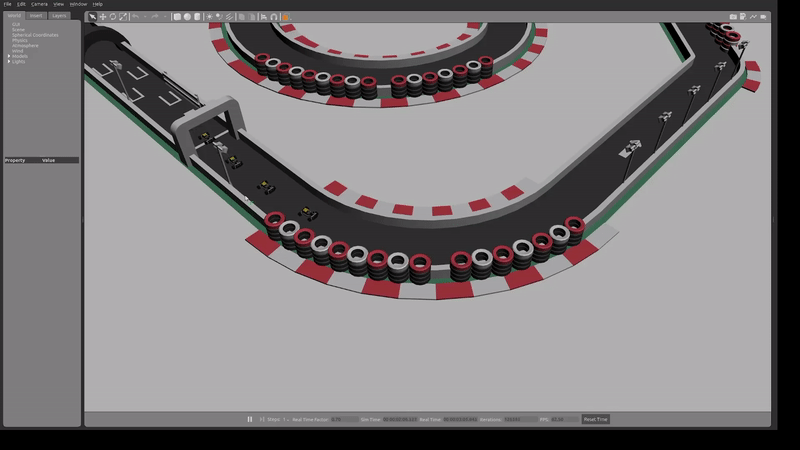

# AuNa: Autonomous Navigation System Simulator

[](https://github.com/HarunTeper/AuNa/actions/workflows/ci.yml)
[](LICENSE)
[](https://docs.ros.org/en/humble/)

AuNa is an open-source ROS 2 framework and simulation testbed for reproducible
autonomous-navigation and multi-robot experiments. It packages the pieces
normally assembled by hand for each new study — robot models, a Gazebo world,
Nav2, a cooperative controller, V2X messaging, localization and visualization —
into a single Docker Compose deployment, so that an entire cooperative-driving
scenario starts from one command and runs the same way on another machine.



**Who it is for.** Robotics and vehicular-networking researchers, students, and
ROS 2 developers who need a working multi-robot autonomous-driving scenario as a
starting point rather than a from-scratch integration effort.

**The problem it addresses.** Cooperative-driving experiments span robotics,
control, and communication, and each of those layers has its own simulator.
Standing up one consistent scenario across them — with several robots, correct
namespacing, transforms, and a repeatable environment — is a substantial
integration task that is typically redone per project and rarely reproducible
across machines. AuNa provides that integration as maintained infrastructure.

## Capabilities

- **Multi-robot Gazebo simulation** — namespaced robots (`robot1`, `robot2`, …)
  spawned into shared worlds, with per-robot navigation and control stacks.
- **Nav2 integration** — path planning, obstacle avoidance, waypoint following,
  and a custom behavior tree.
- **CACC / platooning** — a Cooperative Adaptive Cruise Control controller for
  maintaining inter-vehicle distance in a platoon.
- **Wall following** — a LiDAR-based PID wall-following controller.
- **V2X communication** — ETSI ITS-G5 CAM message handling, with optional
  OMNeT++ network simulation in place of direct message exchange.
- **Localization** — EKF sensor fusion and ground-truth pose publishing for
  comparison against estimated state.
- **Runtime control switching** — an RViz panel selects each robot's input
  source (`wallfollowing`, `teleop`, `nav2`, `cacc`, or `OFF`) while running.
- **Reproducible deployment** — Docker Compose profiles define complete
  scenarios; no manual ROS 2 installation is required.
- **Physical platform support** — an F1TENTH-class package for running the same
  stack on scaled hardware.

## Quick start

**Prerequisites:** Docker with Compose v2 support, and an X11 display for the
Gazebo and RViz windows.

```bash
git clone https://github.com/HarunTeper/AuNa.git
cd AuNa
```

Select the world in the `.env` file, then launch a scenario profile. The world
and the profile must match:

```bash
# Racing scenario — 1 robot on a racetrack
# set WORLD_NAME=racetrack_decorated in .env
docker compose --profile racing up
```

```bash
# Platooning scenario — 3 robots in an open arena
# set WORLD_NAME=arena in .env
docker compose --profile platooning up
```

Gazebo and RViz start automatically. In the RViz control panel, enter a robot
namespace (`robot1`, `robot2`, `robot3`) and select an input source to begin
autonomous control. On the racetrack, `wallfollowing` drives the single robot;
in the arena, `cacc` makes `robot2` and `robot3` follow `robot1`.

The first run builds the container images and takes several minutes.

## Architecture

AuNa is a ROS 2 workspace under `packages/src/`, with configuration, worlds,
maps, and waypoints shared through `auna_common/`. Each Docker Compose service
runs one ROS 2 node or launch file; a scenario profile composes the services
that make up a complete experiment, replicated per robot namespace.

```
LiDAR / odometry ─┐
                  ├─→ localization (auna_ekf, auna_ground_truth, auna_tf)
Gazebo world ─────┘                │
                                   ▼
       ┌────────── control sources (one active per robot) ──────────┐
       │  auna_nav2   auna_cacc   auna_wallfollowing   teleop       │
       └────────────────────────────┬───────────────────────────────┘
                                    ▼
                    auna_control (command multiplexer)
                                    ▼
                          robot in Gazebo / F1TENTH

       auna_comm ── CAM / V2X messages ── auna_omnet (optional network sim)
```

### Packages

| Package | Role |
| --- | --- |
| `auna_gazebo` | Simulation environment, worlds, and robot models |
| `auna_control` | Input-source selection and command multiplexing |
| `auna_ground_truth` | Ground-truth localization from the simulator |
| `auna_nav2` | Navigation2 integration and behavior tree |
| `auna_cacc` | Cooperative Adaptive Cruise Control for platooning |
| `auna_wallfollowing` | LiDAR-based PID wall following |
| `auna_waypoints` | Waypoint management and route publishing |
| `auna_ekf` | Extended Kalman Filter sensor fusion |
| `auna_tf` | Transform frame management and broadcasting |
| `auna_comm` | V2X communication and CAM messages |
| `auna_msgs` | Custom message and service definitions |
| `auna_its_msgs` | ITS (Intelligent Transportation Systems) messages |
| `auna_omnet` | OMNeT++ network simulation integration |
| `auna_teleoperation` | Manual keyboard and joystick control |
| `auna_f110` | F1TENTH-class physical platform integration |
| `auna_template` | Template package for new development |

Shared assets live in `auna_common/` (worlds, maps, waypoints, RViz layouts,
behavior trees, and per-component parameter files under `config/`).

## Supported configurations

| Component | Supported | Notes |
| --- | --- | --- |
| ROS 2 distribution | Humble | Built and tested in CI; `ROS_DISTRO` in `.env` |
| Host OS | Linux with Docker | Developed on Ubuntu; GUI needs an X11 display |
| Middleware | `rmw_zenoh_cpp` (default) | Configurable via `RMW_IMPLEMENTATION` |
| Simulator | Gazebo | Launched by the `gazebo` Compose service |
| Worlds | `racetrack_decorated`, `arena` | Set `WORLD_NAME` in `.env` |
| Physical hardware | F1TENTH-class vehicles | Via `auna_f110`; not covered by CI |

Other ROS 2 distributions are not currently verified. Work targeting newer
Gazebo and ROS 2 releases is kept on separate branches.

## Configuration

Commonly changed settings are at the top of `.env`:

- `WORLD_NAME` — `racetrack_decorated` or `arena`; must match the profile.
- `COMMUNICATION_TYPE` — `cam` for direct V2X messages, `omnet` to route them
  through the OMNeT++ network simulation.
- `ROS_DOMAIN_ID`, `RMW_IMPLEMENTATION`, `ROS_DISTRO` — ROS 2 runtime settings.

Node parameters live in `auna_common/config/`, grouped by component
(`cacc/`, `nav2/`, `ekf/`, `wallfollowing/`, `control/`, …).

## Development

A development container with the workspace pre-built and sourced:

```bash
docker compose run development
```

Inside the container, build and test with colcon:

```bash
cd packages
colcon build --symlink-install
colcon test
colcon test-result --verbose
```

`scripts/run_quality_checks.sh` runs copyright-header insertion, linting, and
tests together. See [`scripts/README.md`](scripts/README.md) for details.

CI builds every package and runs the test suite on ROS 2 Humble, and separately
verifies that the Docker image builds — see
[`.github/workflows/ci.yml`](.github/workflows/ci.yml).

## Troubleshooting

**Containers fail to start.** Check the Docker daemon with
`sudo systemctl status docker`, and rebuild with
`docker compose build --no-cache`.

**Gazebo crashes or runs slowly.** Verify GPU drivers with `nvidia-smi`, or fall
back to software rendering by setting `LIBGL_ALWAYS_SOFTWARE=1`.

**A robot does not respond in RViz.** Confirm the namespace matches exactly
(`robot1`, not `/robot1` or `robot 1`), that the corresponding containers are
running (`docker compose ps`), and allow a few seconds after selecting an input
source for the multiplexer to switch.

**Nothing moves after launching.** The default input source is `OFF`
(`INITIAL_SOURCE` in `docker-compose.yml`). Select a source in the RViz control
panel for each robot.

## Research and publications

AuNa was developed at TU Dortmund University as research infrastructure for
cooperative and connected autonomous systems. It exists to make cooperative
driving experiments — which span robotics, control, and vehicular networking —
reproducible in a single integrated environment.

The framework is described in:

> H. Teper, A. Bayuwindra, R. Riebl, R. Severino, J.-J. Chen, and K.-H. Chen,
> "AuNa: Modularly Integrated Simulation Framework for Cooperative Autonomous
> Navigation," arXiv:2207.05544, 2022.
> [doi:10.48550/arXiv.2207.05544](https://doi.org/10.48550/arXiv.2207.05544)

This paper describes the integration of ROS 2, OMNeT++, and MATLAB that this
repository implements, and evaluates a platooning scenario under CACC with the
ETSI ITS-G5 communication architecture. The repository has since evolved beyond
the version described there — most notably the move to ROS 2 Humble and the
Docker Compose deployment — but the architecture and the CACC/V2X components
follow the design presented in the paper.

AuNa has also been used as simulation infrastructure by other work, including:

> C. Krieger, H. Teper, J. Freytag, I. F. Priyanta, P. Schulte, M. Roidl,
> J.-J. Chen, and C. Wietfeld, "Integration of Scaled Real-world Testbeds with
> Digital Twins for Future AI-Enabled 6G Networks," 2023 IEEE Globecom
> Workshops (GC Wkshps), 2023.

which uses AuNa's ROS 2 navigation stack and CACC platooning controller on the
simulative side of a digital-twin testbed.

If you use AuNa in your research, please cite it using
[`CITATION.cff`](CITATION.cff).

## Contributing

Contributions are welcome. See [`CONTRIBUTING.md`](CONTRIBUTING.md) for the
development workflow, build and test expectations, coding style, and what to
include when changing ROS 2 packages or multi-robot behavior.

Bug reports and feature requests go through
[GitHub Issues](https://github.com/HarunTeper/AuNa/issues) using the provided
templates. Pull requests should target the `main` branch.

## License

AuNa is released under the [MIT License](LICENSE). All 16 ROS 2 packages in
`packages/src/` declare `MIT` in their `package.xml`, and first-party source
files carry MIT headers.

AuNa depends on third-party software that is not vendored in this repository and
remains under its own license, including ROS 2, Navigation2, Gazebo, and — when
`COMMUNICATION_TYPE=omnet` — OMNeT++ and Artery. These are obtained at build or
run time; consult each project for its terms.

## Contact

- **Issues and questions:** [GitHub Issues](https://github.com/HarunTeper/AuNa/issues)
- **Maintainer:** Harun Teper — harun.teper@tu-dortmund.de
